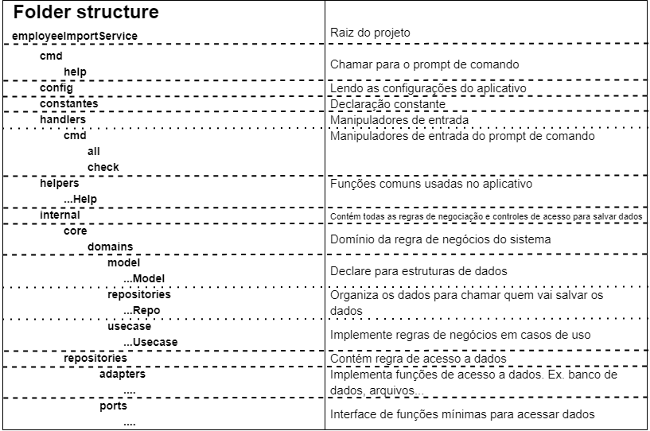
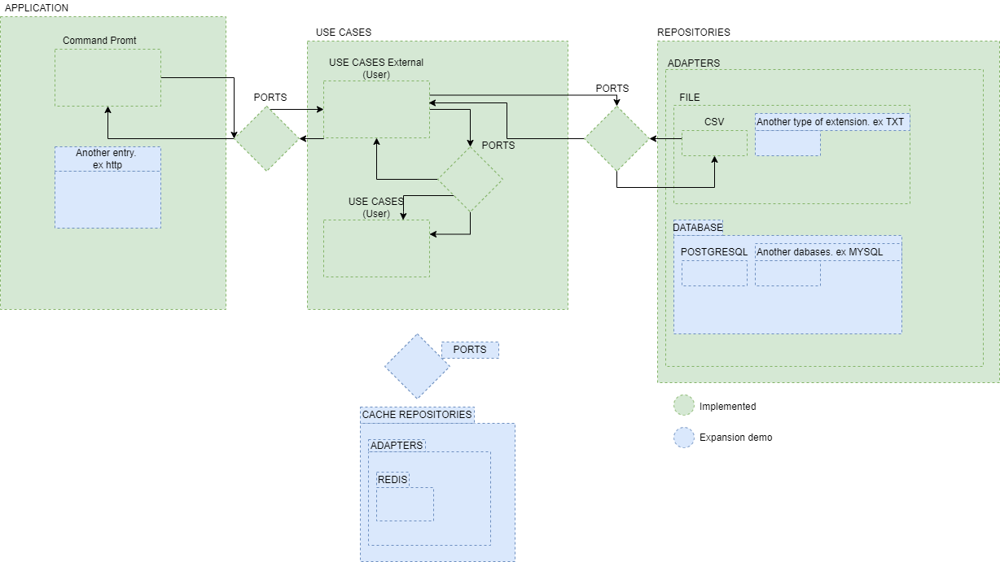

<!-- TABLE OF CONTENTS -->
<details>
  <summary>Índice</summary>
  <ol>
    <li>
      <a href="#about-the-project">Sobre o projeto</a>
      <ul>
        <li><a href="#built-with">Construído com</a></li>
      </ul>
    </li>
    <li>
      <a href="#getting-started">Começando</a>
      <ul>
        <li><a href="#prerequisites">Pré-requisitos</a></li>
        <li><a href="#installation">Instalação</a></li>
      </ul>
    </li>
    <li><a href="#usage">Uso</a></li>
  </ol>
</details>


<!-- ABOUT THE PROJECT -->
## Sobre o projeto
### Estrutura do projeto
<p align="center">
  
</p>

### Arquitetura do projeto

<p align="center">
  
</p>

Foi escolhida a arquitetura hexagonal para a implementação deste desafio. Sua escolha deu-se por diversos motivos, como por exemplo, a facilidade de se adaptar-se, testar, modificar e evoluir.

Como apresentado na imagem acima em verde está a implementação feita para este desafio e em azul estão algumas possíveis evoluções do projeto. Cada camada ficou com responsabilidade única, sendo a aplicação em expor a aplicação, casos de uso a regra de negócio do sistema e em repositórios por fazer o controle dos dados da aplicação.

Na aplicação por exemplo podemos expandir os serviços suportados pela a aplicação com por exemplo um servidor de http, mensageria entre outros. Como pode ser visto pela imagem isso não impactaria nas demais camadas do sistema.

No repositório pode ser criar novos suportes a arquivos, banco de dados ou outras formas de armazenar os dados

Uma evolução da aplicação poderia ser outra camada de cache que abriria suas portas para serem consumidas pelos casos de uso.

A arquitetura hexagonal, ou arquitetura de portas e adaptadores, é um padrão de arquitetura usado em
Design de software. Ele visa a criação de componentes de aplicativos fracamente acoplados que podem ser facilmente conectados
ao seu ambiente de software por meio de portas e adaptadores. Isso torna os componentes intercambiáveis em qualquer
nível e facilita a automação de testes.

* Fonte: [hexagonal architecture](https://en.wikipedia.org/wiki/Hexagonal_architecture_(software))

### Construído com

* [GO](https://go.dev/)

<p align="right">(<a href="#top">de volta ao topo</a>)</p>

<!-- GETTING STARTED -->
## Começando

Este é um exemplo de como você pode dar instruções sobre como configurar seu projeto localmente.
Para colocar uma cópia local em execução, siga estas etapas de exemplo simples.

### Pré-requisitos

Este é um exemplo de como listar as coisas que você precisa para usar o software e como instalá-las.
* GO
  ```sh
  go build
  ```

### Instalação

_Abaixo está um exemplo de como você pode instruir seu público sobre como instalar e configurar seu aplicativo. Este modelo não depende de nenhuma dependência ou serviço externo._

1. Instalar [golang](https://go.dev/)
2. Criar executável
   ```sh
   go build
   ```
3. Criar arquivo de configuração "headerConfiguration"
   ```json
   {
      "FullName":   ["name", "fullname"],
      "FirstName":  ["firstname", "first", "fname", "fname"],
      "MiddleName": ["middlename", "middle"],
      "LastName":   ["lastname", "last", "lname"],
      "Email":      ["email", "mail", "airmail", "electronicmail", "junkmail", "mail", "postalcard", "postcard"],
      "Salary":     ["emolument", "hire", "packet", "pay", "payenvelope", "paycheck", "payment", "stipend", "wage", "salary", "rate"],
      "Identifier": ["id", "key", "identify", "uid", "hash", "hashid", "idhash", "number", "seq", "sequence", "employeenumber", "empid"],
      "Phone":      ["phone", "call", "dial", "ring", "telephone"],
      "Mobile":     ["mobile"]
   }
   ```
4. Criar estrutura de diretório
    ```sh
    ->transfer
      --->error
      --->pending
      --->processed
      --->processedError
      --->success
    ```
4.1 Criar estrutura de diretório
    ```sh
      mkdir error pending processed processedError success
    ```
<p align="right">(<a href="#top">de volta ao topo</a>)</p>


<!-- USAGE EXAMPLES -->
## Uso
1. Criar executável
   ```sh
    Success file is located:              ./success
    Fault file is located:                ./error
    Pending file is located:              ./pending
    Processed files are located:          ./processed
    Processed with error file is located: ./processedError
   ```
2. Executar arquivo --help ".\uploader.exe --help"  
   ```sh
   Usage:
   uploader [command] [flags]
   uploader [command]
   
   Available Commands:
    all         Processes all
    check       The check command process a specific file
    completion  Generate the autocompletion script for the specified shell
    help        Help about any command
   
   Flags:
    --config string   config file (default is ./headerConfiguration)
    -h, --help            help for uploader
   ```
3. Executar arquivo check --help ".\uploader.exe check --help"
   ```sh
   Usage:
   uploader check [flags]
   
   Flags:
    -f, --file string        The csv file to be validated
    -t, --file type string   sets the file type (default "csv")
    -e, --header             If the csv file has a col title header or not (default true)
    -h, --help               help for check
   
   Global Flags:
    --config string   config file (default is ./.headerConfiguration)
   ```
4. Executar um arquivo check
   ```
   uploader check -f "<file path>"
   ```
4. Executar todos os arquivo
   ```
   uploader all
   ```

<p align="right">(<a href="#top">de volta ao topo</a>)</p>


