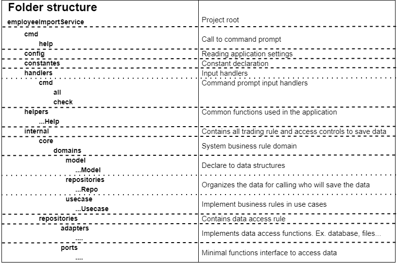

<!-- TABLE OF CONTENTS -->
<details>
  <summary>Table of Contents</summary>
  <ol>
    <li>
      <a href="#about-the-project">About The Project</a>
      <ul>
        <li><a href="#built-with">Built With</a></li>
      </ul>
    </li>
    <li>
      <a href="#getting-started">Getting Started</a>
      <ul>
        <li><a href="#prerequisites">Prerequisites</a></li>
        <li><a href="#installation">Installation</a></li>
      </ul>
    </li>
    <li><a href="#usage">Usage</a></li>
  </ol>
</details>


<!-- ABOUT THE PROJECT -->
## About The Project
### Project structure
<p align="center">
  
</p>

### Project architecture

<p align="center">
  
</p>

The hexagonal architecture was chosen for the implementation of this challenge. Its choice was made for several reasons, such as the ease of adapting, testing, modifying and evolving.

As shown in the image above, in green is the implementation made for this challenge and in blue are some possible evolutions of the project. Each layer was left with single responsibility, with the application in exposing the application, use cases as the system's business rule and in repositories for controlling the application's data.

In the application, for example, we can expand the services supported by the application with, for example, an http server, messaging, among others. As can be seen from the image, this would not impact the other layers of the system.

In the repository can be create new file supports, database or other ways to store the data

An evolution of the application could be another cache layer that would open its doors to be consumed by the use cases.

The hexagonal architecture, or ports and adapters architecture, is an architectural pattern used in 
software design. It aims at creating loosely coupled application components that can be easily connected 
to their software environment by means of ports and adapters. This makes components exchangeable at any
level and facilitates test automation.

* Link: [hexagonal architecture](https://en.wikipedia.org/wiki/Hexagonal_architecture_(software))

### Built With

* [GO](https://go.dev/)

<p align="right">(<a href="#top">back to top</a>)</p>

<!-- GETTING STARTED -->
## Getting Started

This is an example of how you may give instructions on setting up your project locally.
To get a local copy up and running follow these simple example steps.

### Prerequisites

This is an example of how to list things you need to use the software and how to install them.
* GO
  ```sh
  go build
  ```

### Installation

_Below is an example of how you can instruct your audience on installing and setting up your app. This template doesn't rely on any external dependencies or services._

1. Install [golang](https://go.dev/)
2. Create executable
   ```sh
   go build
   ```
3. Create configuration file "headerConfiguration"
   ```json
   {
      "FullName":   ["name", "fullname"],
      "FirstName":  ["firstname", "first", "fname", "fname"],
      "MiddleName": ["middlename", "middle"],
      "LastName":   ["lastname", "last", "lname"],
      "Email":      ["email", "mail", "airmail", "electronicmail", "junkmail", "mail", "postalcard", "postcard"],
      "Salary":     ["emolument", "hire", "packet", "pay", "payenvelope", "paycheck", "payment", "stipend", "wage", "salary", "rate"],
      "Identifier": ["id", "key", "identify", "uid", "hash", "hashid", "idhash", "number", "seq", "sequence", "employeenumber", "empid"],
      "Phone":      ["phone", "call", "dial", "ring", "telephone"],
      "Mobile":     ["mobile"]
   }
   ```
4. Create directory structure
    ```sh
    ->transfer
      --->error
      --->pending
      --->processed
      --->processedError
      --->success
    ```
4.1 Create directory structure
    ```sh
      mkdir error pending processed processedError success
    ```
<p align="right">(<a href="#top">back to top</a>)</p>


<!-- USAGE EXAMPLES -->
## Usage
1. Create executable
   ```sh
    Success file is located:              ./success
    Fault file is located:                ./error
    Pending file is located:              ./pending
    Processed files are located:          ./processed
    Processed with error file is located: ./processedError
   ```
2. Run file --help ".\uploader.exe --help"  
   ```sh
   Usage:
   uploader [command] [flags]
   uploader [command]
   
   Available Commands:
    all         Processes all
    check       The check command process a specific file
    completion  Generate the autocompletion script for the specified shell
    help        Help about any command
   
   Flags:
    --config string   config file (default is ./headerConfiguration)
    -h, --help            help for uploader
   ```
3. Run file check --help ".\uploader.exe check --help"
   ```sh
   Usage:
   uploader check [flags]
   
   Flags:
    -f, --file string        The csv file to be validated
    -t, --file type string   sets the file type (default "csv")
    -e, --header             If the csv file has a col title header or not (default true)
    -h, --help               help for check
   
   Global Flags:
    --config string   config file (default is ./.headerConfiguration)
   ```
4. Run one file check
   ```
   uploader check -f "<file path>"
   ```
4. Run all files
   ```
   uploader all
   ```

<p align="right">(<a href="#top">back to top</a>)</p>


